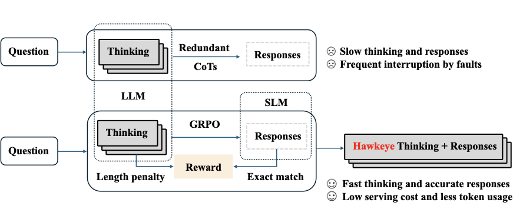
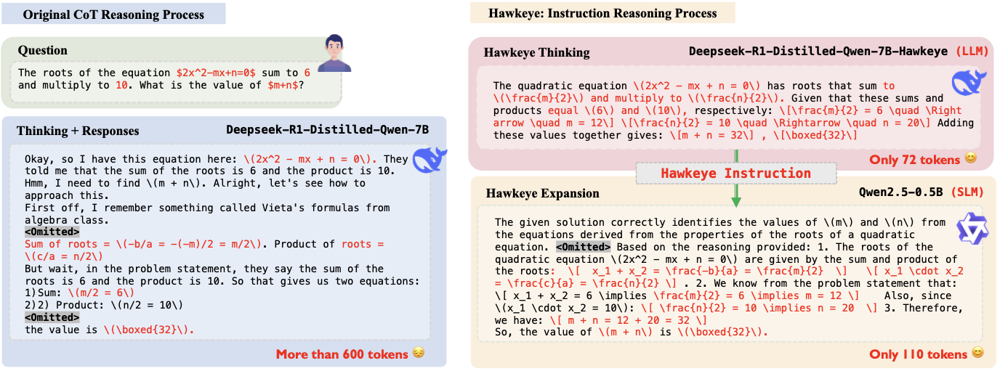
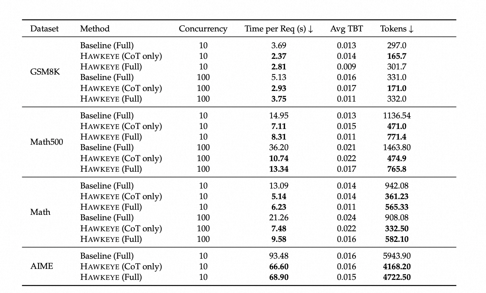
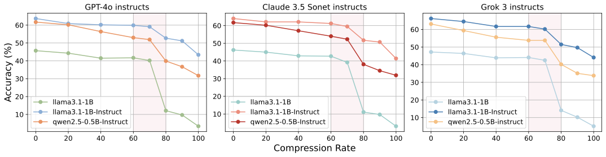
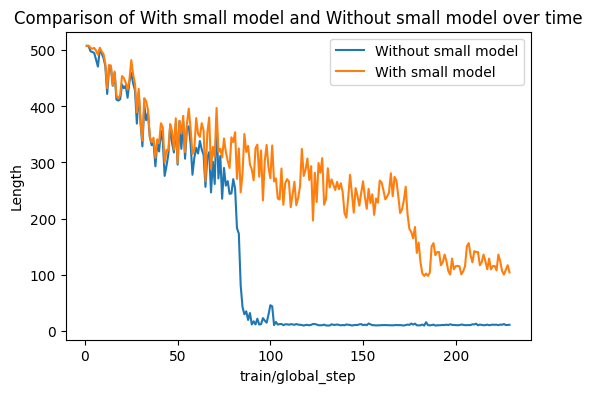
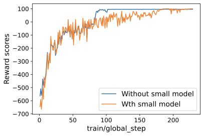

# Hawkeye: Model Collaboration for Efficient Reasoning

[](https://arxiv.org/abs/2504.00424)
[](https://github.com/Jianshu1only/Efficient_CoT)
[](https://huggingface.co/Jianshu001/Efficient_CoT_DeepSeek-R1-Distill-Qwen-7B)
[](https://zhuohao-li.github.io/Hawkeye)
[](/assets/poster.pdf)

## 📖 Overview

**Hawkeye** is an efficient reasoning framework with **Model Collaboration**, where a large model produces concise instructions to guide a lightweight model in response preparation and generation. Hawkeye quantifies redundancy in LRM and distills high-density information via RLHF.

<p align="center">
  
</p>



## 🎯 Key Features

- **🚀 Efficiency**: Achieves up to 67.6% reduction in reasoning tokens
- **💰 Cost Reduction**: Reduces serving cost by up to 62%
- **⚡ Speed**: Accelerates end-to-end reasoning by up to 3.4×
- **🎯 Quality**: Maintains comparable response quality while improving clarity and coherence
- **🔧 Flexibility**: Supports various model combinations and system prompts

## 🚀 Quick Start

### Installation

```bash
git clone https://github.com/Jianshu1only/Efficient_CoT.git
cd Efficient_CoT
pip install -r requirements.txt
```

### Basic Usage

```python
from hawkeye import Hawkeye

# Initialize Hawkeye
hawkeye = Hawkeye(
    large_model="DeepSeek-R1-Distill-Qwen-7B",
    small_model="Qwen2.5-0.5B-Instruct"
)

# Generate response
response = hawkeye.generate(
    question="What is the sum of the first 100 natural numbers?",
    max_tokens=512
)
```

### Evaluation

```bash
# Run GSM8K evaluation
python bench/gsm8k_evaluate_cot.py --model_path your_model_path --test_file gsm8k_cot.jsonl

# Run MATH evaluation
python bench/math_evaluate_cot.py --model_path your_model_path --test_file math_cot.jsonl
```

## 📁 Project Structure

```
Hawkeye/
├── benchmark/                    # Benchmark evaluation scripts
│   ├── gsm8k_evaluate_cot.py
│   ├── math_evaluate_cot.py
│   └── results/             # Evaluation results
├── evaluation/              # Model evaluation utilities
├── hawkeye/                # core code
│   ├── finetune/               # Fine-tuning scripts
│   ├── model/                  # Model configurations
├── docs/                   # Documentation and website
├── assets/
```

## 🏗️ Architecture

Hawkeye introduces **model collaboration**, wherein a powerful model generates concise reasoning instructions, and small models expand them into human-readable responses.

### Two-Phase Reasoning Workflow

1. **Phase 1**: Large Language Model (LLM) constructs core logical framework
2. **Phase 2**: Smaller Language Model (SLM) leverages structured outline to generate comprehensive responses


## 📊 Performance Results

### Accuracy Comparison

Hawkeye achieves comparable accuracy to baseline models while significantly reducing computational cost:


### Cost Efficiency

Hawkeye reduces inference cost by up to 60% while maintaining performance. Our evaluation shows that Hawkeye can achieve comparable response quality using only 35% of the full CoTs



## 🔬 Methodology

### Overthink

We observe that CoT reasoning often contains substantial redundancy due to:
1. **Repeated hints**
2. **Filler phrases** (e.g., "Well," "Let me double-check")
3. **Overly fine-grained steps**



### GRPO

Hawkeye employs GRPO (Group Relative Policy Optimization) to fine-tune models for compressed CoT generation:

<div align="center">
  
  
</div>


The reward function is designed as:
```
R = EM(â, a) - λ × max(0, len(c) - 0.3 × len(c_orig))²
```

Where:
- `EM(â, a)`: Exact match score between generated and ground truth answers
- `len(c)`: Token count of generated CoT
- `len(c_orig)`: Token count of original CoT
- `λ`: Length penalty weight

## 📈 Evaluation Results

### Multi-Dataset Performance

| Task | Model | Accuracy(%) | Response Length (Tokens) |
|------|-------|-------------|-------------------------|
| GSM8K | DeepSeek-R1-Distill-Qwen-7B | 85.65 ± 0.63 | 477.98 ± 0.89 |
| GSM8K | Hawkeye | 82.11 ± 0.48 | 413.42 ± 2.19 |
| GPQA Diamond | DeepSeek-R1-Distill-Qwen-7B | 38.72 ± 3.56 | 1975.19 ± 8.90 |
| GPQA Diamond | Hawkeye | 39.23 ± 3.10 | 2006.30 ± 2.23 |
| MATH | DeepSeek-R1-Distill-Qwen-7B | 91.47 | 751.5 |
| MATH | Hawkeye | 87.45 | 208.33 |


## Acknowledge


If you find Hawkeye helpful in your work, we're happy if you cite:

```bibtex
@article{she2025hawkeye,
  title={Hawkeye: Efficient reasoning with model collaboration},
  author={She, Jianshu and Li, Zhuohao and Huang, Zhemin and Li, Qi and Xu, Peiran and Li, Haonan and Ho, Qirong},
  journal={arXiv preprint arXiv:2504.00424},
  year={2025}
}
```

This project is licensed under the Apache License 2.0 - see the [LICENSE](LICENSE) file for details.

**⭐ Star this repository if you find it helpful!**
